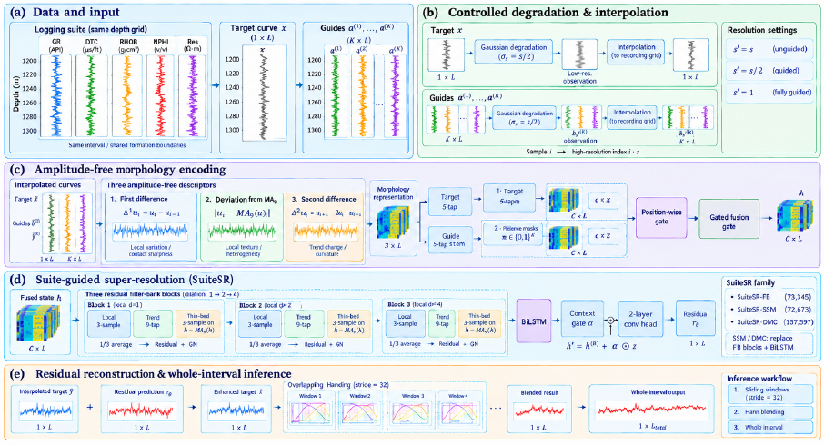
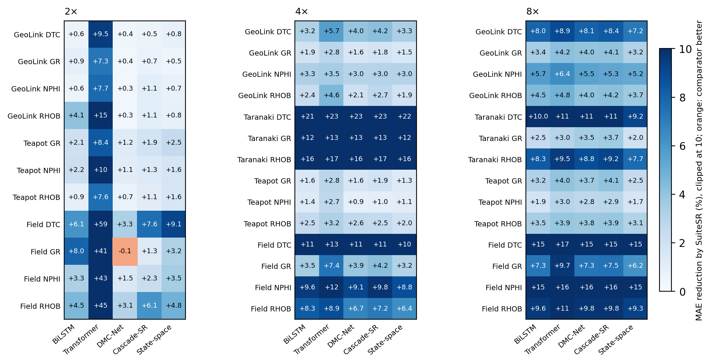
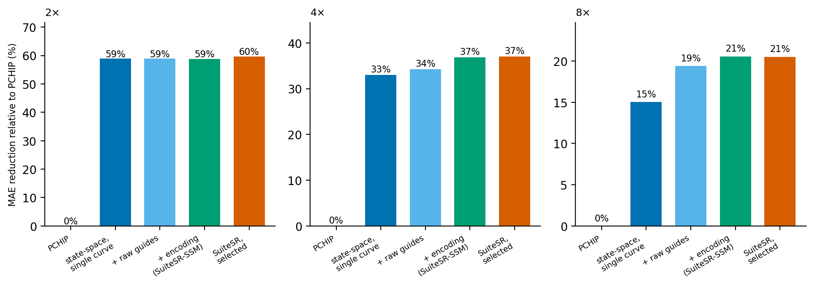
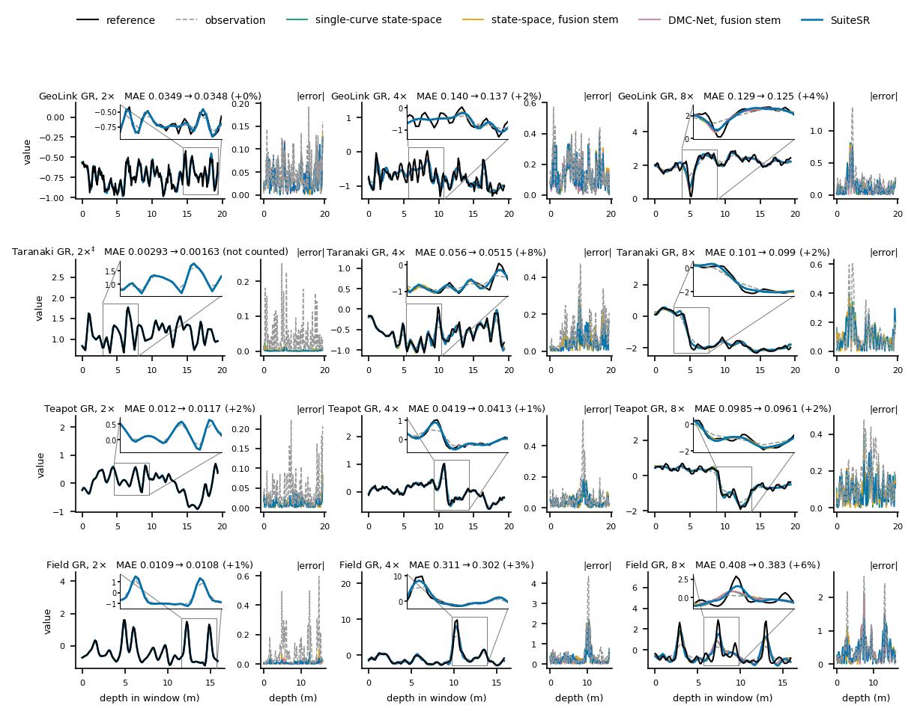
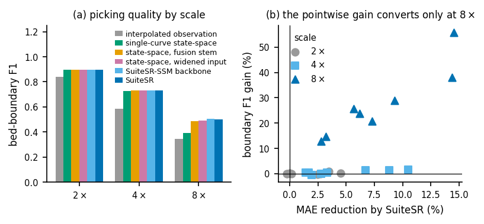
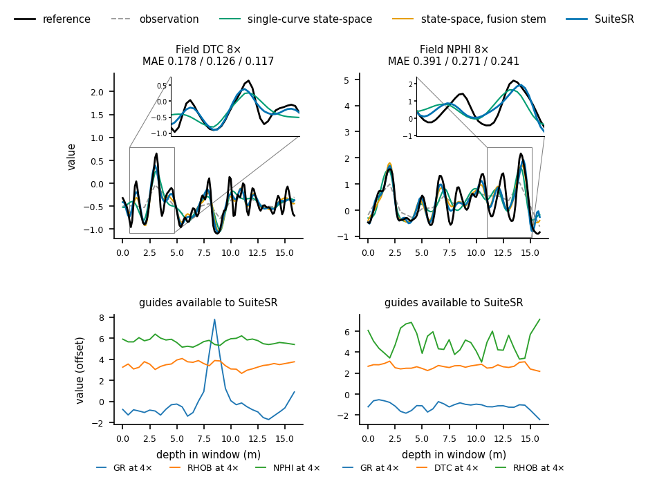
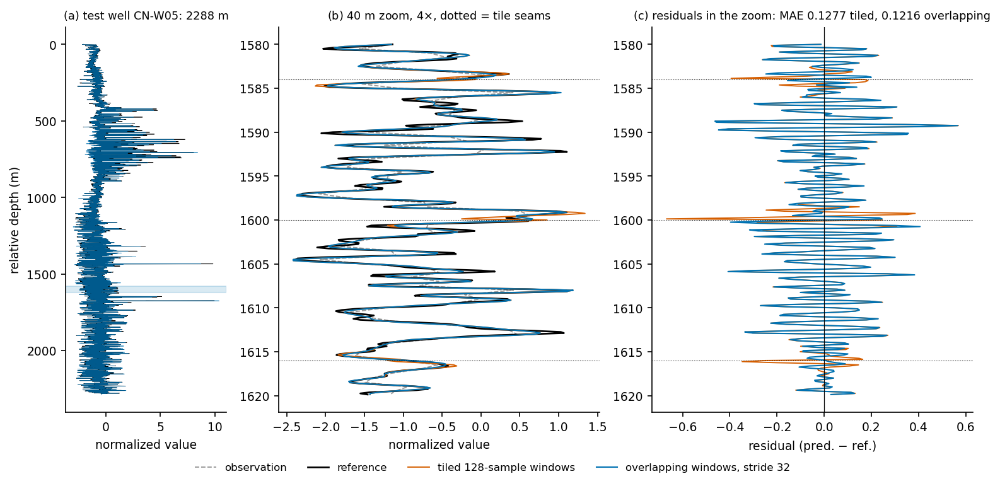

# SuiteSR: guided vertical resolution enhancement of well logs

**SuiteSR：测井曲线的引导式垂向分辨率增强**

[English](#english) | [中文](#中文)

---

## English

Logging tools average the formation over a finite vertical aperture, so a recorded
curve is a low-pass version of the formation: thin beds and sharp contacts are lost
before interpretation begins. SuiteSR restores the lost detail of one curve (the
*target*) from its own low-resolution observation **and** the other curves logged over
the same interval (the *guides*), which are acquired by tools of finer resolution and
share the bed boundaries. This repository holds the method, the comparators, the
benchmark protocol and the configuration of every experiment reported in the
accompanying article.

<p align="center"></p>

*Figure 1. Pipeline. (A) Target and guide curves on one depth grid. (B) Controlled
degradation of the target at scale s and of the guides at their own scale, then
interpolation back to the recording grid. (C) Each curve is reduced to three
amplitude-free morphology descriptors. (D) A position-wise gate admits the guide
stream; filter-bank blocks and a BiLSTM supply local and whole-window context; a
convolutional head predicts a residual. (E) The residual is added to the interpolated
target; whole intervals are reconstructed with overlapping Hann-blended windows.*

### Method

- **Guided task.** Target observation `y = D_s(G_s * x)`; guides observed under the same
  operator at scale `s/2`; both interpolated to the recording grid. Presence masks let
  one model serve suites with two or three guides.
- **Amplitude-free morphology encoding.** Each curve enters as
  `[u_i - u_{i-1}, |u_i - MA_9(u)_i|, u_{i+1} - 2u_i + u_{i-1}]` (first difference,
  deviation from a nine-sample moving average, second difference). The level is removed,
  so a density guide and a sonic target become commensurable; the raw level re-enters
  only through the residual connection `x_hat = y_tilde + r(.)`.
- **SuiteSR family.** The encoding is read by one of three backbones: the filter-bank
  network SuiteSR-FB (`GeoSRv2` in the code), a state-space model (SuiteSR-SSM) or
  DMC-Net (SuiteSR-DMC). Backbone and guide admission (guided or target-only form) are
  chosen per task on validation MAE; test data are never consulted.
- **Blind-degradation training.** Training windows are replicated under narrower, wider
  and box kernels, so the model does not depend on knowing the tool response.
- **Overlapping inference.** Stride-32 windows blended with a Hann taper for whole
  intervals.

### What the results look like

<p align="center"></p>

*Figure 2. MAE reduction by SuiteSR over each of five published single-curve
architectures on every benchmark task at 2x, 4x and 8x degradation (blue: SuiteSR
better; orange: comparator better).*

<p align="center"></p>

*Figure 3. Where the gain comes from: the published single-curve state-space model,
the same model given the raw guide curves, the same model given the morphology
encoding (SuiteSR-SSM), and SuiteSR with the backbone chosen on validation.*

<p align="center"></p>

*Figure 4. Gamma-ray reconstruction on four panels at 2x, 4x and 8x, with the
interpolated observation, the comparators and SuiteSR, an inset at the sharpest
contact and the absolute-error track.*

<p align="center"></p>

*Figure 5. Bed-boundary picking on the reconstructions: guided reconstruction
separates from single-curve reconstruction only at 8x, where the observation no longer
resolves the contacts.*

<p align="center"></p>

*Figure 6. Two field windows at 8x where the guides matter most, with the guide
observations available to the model.*

<p align="center"></p>

*Figure 7. Whole-interval inference on a field test well: tiled windows leave seams;
overlapping Hann-blended windows remove them.*

### Repository layout

```
src/wellsr/
  data.py          panel loading, well-level splits, window construction (single- and multi-curve)
  degradation.py   Gaussian / box / triangular / asymmetric response operators, grid-aligned resampling
  models.py        the five comparator architectures: BiLSTM, Transformer, DMC-Net, Cascade-SR, state-space
  models_v2.py     SuiteSR (GeoSRv2, shape_channels, FilterBankBlock) and the guided forms of the
                   comparators: MultiInput (fusion stem), MultiInputNative (widened first layer),
                   MorphologyNative (widened layer fed the encoding = SuiteSR-SSM / SuiteSR-DMC)
  losses.py        L1 + squared error + gradient + spectral-amplitude objective
  metrics.py       MAE, RMSE, Grad-MAE, band-limited HF-RMSE, DC-excluded spectral angle, CC, fixed-range PSNR
  train.py         training loop, early stopping on validation loss, deterministic mode
scripts/
  build_public_panels.py        rebuild the GeoLink / Taranaki / Teapot panels at well level
  build_field_panel.py          build a panel of the same schema from standard well files
  run_benchmark_v2.py           one YAML config -> one results directory
  run_v2_queue.sh               run a list of configs, N at a time
  audit_source_resolution.py    flag curves that are piecewise linear at their nominal step
  analyze_crosscurve_ceiling.py per-window linear oracle: how much residual the guides can explain
  eval_boundary_guided.py       bed-boundary picking on the reconstructions (with eval_boundary_downstream.py)
  analyze_field_wells.py        per-well bootstrap on the field panel
  eval_whole_slice_inference.py tiled vs overlapping vs single-pass whole-interval reconstruction
  eval_seed_ensemble.py         average models that share a data seed but differ in model seed
configs/
  v7/    the SuiteSR family under one loss, three seeds (headline benchmark)
  v2/    comparators (single-curve, fusion stem, widened, encoded), guide-resolution settings,
         ablation, controls, robustness, held-out operators, depth registration, transfer,
         ordered suites, downstream evidence, 4,096-window and full-capacity runs
  v7b/   widened Transformer / Cascade-SR, extra depth-registration seeds, low-data caps
  v6/    seed-ensemble and observation-mask runs
tests/     protocol invariants (well-disjoint splits, grid alignment, metrics, model shapes)
docs/      the figures shown in this file
```

### Installation

```bash
git clone https://github.com/freewangfei/SuiteSR.git
cd SuiteSR
python -m pip install -e .          # installs the wellsr package and its dependencies
```

Python 3.10 or later and PyTorch 2.x are required; a CUDA GPU is recommended (one
task trains in about ten seconds on an RTX 5090).

### Workflow

```bash
# 1. data: rebuild the public panels at well level (needs the Gama et al. 2025 benchmark release)
python scripts/build_public_panels.py
python scripts/audit_source_resolution.py          # source-resolution audit

# 2. protocol invariants
pytest

# 3. one run: every method in the config, every curve and scale, one results directory
python scripts/run_benchmark_v2.py --config configs/v7/family_geolink_seed2026.yaml

# 4. a whole study: the queue runs each config in the list with N concurrent processes
JOBS=configs/v7/jobs.txt PY=python bash scripts/run_v2_queue.sh 4

# 5. downstream and deployment analyses on saved predictions
python scripts/eval_boundary_guided.py
python scripts/eval_whole_slice_inference.py
python scripts/eval_seed_ensemble.py
```

If the package is not installed, prefix the commands with `PYTHONPATH=src`.

A config names the panel, the curves, the scales, the window and split caps, the
training schedule, the degradation operators (empty list = matched Gaussian; a list =
blind training) and a `methods:` block. Each method gives `arch` (a name known to
`build_model_v2`), `multi: true/false` (guided or single-curve input), width, depth and
loss weights. A run writes `summary_metrics.csv` (task means), `window_metrics.csv`
(per window, keyed by well and depth) and, with `save_predictions: true`,
`predictions/*.npz` holding validation and test predictions with their window
identities.

Model names accepted by `build_model_v2`: `geosr2` (SuiteSR-FB), `geosr2_long`,
`geosr2_obs_mask`, the ablations `geosr2_{nomorph,norecur,plainblock,deep,nogate,
morphtarget,morphguide,dropgrad,droprough,dropcurv,ma5,ma15,gd,gd5}`, the comparators
`lstm | transformer | dmcnet | cascade_sr | ssm` (single-curve, or fusion stem when
`multi: true`), their widened forms `*_native`, and the encoded backbones
`ssm_morph_native` (SuiteSR-SSM) and `dmcnet_morph_native` (SuiteSR-DMC).

### Data

The three public panels derive from the well-log benchmark of Gama et al. (2025)
(GeoLink, Taranaki Basin, Teapot Dome) and are rebuilt with well-disjoint splits by
`build_public_panels.py`; obtain the raw data from that release under its terms. The
ten-well field panel is proprietary and is not included; `build_field_panel.py` builds
a panel of the same schema from standard well files.

### Citation and license

See `CITATION.cff` and `LICENSE` (MIT).

---

## 中文

测井仪器在有限的垂向孔径内对地层响应做平均，记录下来的曲线是地层的低通版本：薄层和锐利的岩性界面在解释之前就已被平滑。SuiteSR 利用同一测井系列中分辨率更高的其他曲线（**引导曲线**）恢复目标曲线丢失的细节——不同仪器测的是同一套地层，层界位置是共享的，只是幅值、单位和分辨率不同。本仓库包含方法、对比方法、基准协议以及论文中每项实验的配置。

<p align="center"></p>

*图 1 流程。(A) 同一深度网格上的目标曲线与引导曲线。(B) 目标以尺度 s、引导以各自尺度做受控降质，再插值回记录网格。(C) 每条曲线归约为三个无幅值形态描述子。(D) 逐位置门控引入引导流；滤波器组块与 BiLSTM 提供局部和全窗口上下文；卷积头预测残差。(E) 残差加回插值后的目标；全井用重叠 Hann 加权窗口重建。*

### 方法

- **引导任务。** 目标观测 `y = D_s(G_s * x)`；引导曲线在同一算子下以 `s/2` 尺度观测；两者都插值回记录网格。存在性掩码使一个模型可同时服务含两条或三条引导曲线的系列。
- **无幅值形态编码。** 每条曲线以 `[u_i - u_{i-1}, |u_i - MA_9(u)_i|, u_{i+1} - 2u_i + u_{i-1}]`（一阶差分、对九点滑动平均的偏离、二阶差分）进入网络。去掉了曲线的水平值，密度引导曲线与声波目标曲线因此可以通约；原始幅值只通过残差连接 `x_hat = y_tilde + r(.)` 回到输出。
- **SuiteSR 方法族。** 同一编码由三种骨干之一读取：滤波器组网络 SuiteSR-FB（代码中的 `GeoSRv2`）、状态空间模型 SuiteSR-SSM、DMC-Net 骨干 SuiteSR-DMC。骨干以及是否启用引导（引导形式或仅目标形式）按任务在验证集 MAE 上选择，不接触测试集。
- **盲降质训练。** 训练窗口在更窄、更宽的高斯核和箱形核下复制，使模型不依赖已知的仪器响应。
- **重叠推断。** 全井重建时用步长 32 的重叠窗口配合 Hann 加权融合。

### 结果示意

<p align="center"></p>

*图 2 SuiteSR 相对五种已发表单曲线架构在每个基准任务上的 MAE 降幅（2×、4×、8×；蓝色为 SuiteSR 更好，橙色为对比方法更好）。*

<p align="center"></p>

*图 3 增益来源：已发表的单曲线状态空间模型 → 同一模型加原始引导曲线 → 同一模型加形态编码（SuiteSR-SSM）→ 验证集选择骨干的 SuiteSR。*

<p align="center"></p>

*图 4 四个面板上的 GR 曲线重建（2×、4×、8×），含插值观测、对比方法与 SuiteSR，最锐界面处的局部放大与绝对误差道。*

<p align="center"></p>

*图 5 重建结果上的层界拾取：引导式重建只在 8× 下与单曲线重建拉开差距，此时观测本身已无法分辨界面。*

<p align="center"></p>

*图 6 引导曲线作用最大的两个现场井 8× 窗口，以及模型可用的引导观测。*

<p align="center"></p>

*图 7 现场测试井的全井重建：拼接窗口留下接缝，重叠 Hann 加权窗口消除接缝。*

### 仓库结构

```
src/wellsr/
  data.py          面板读取、井级划分、窗口构建（单曲线与多曲线）
  degradation.py   高斯 / 箱形 / 三角 / 非对称响应算子，网格对齐的重采样
  models.py        五种对比架构：BiLSTM、Transformer、DMC-Net、Cascade-SR、状态空间模型
  models_v2.py     SuiteSR（GeoSRv2、shape_channels、FilterBankBlock）及对比方法的引导形式：
                   MultiInput（fusion stem）、MultiInputNative（加宽首层）、
                   MorphologyNative（加宽首层并输入编码，即 SuiteSR-SSM / SuiteSR-DMC）
  losses.py        L1 + 平方误差 + 梯度 + 谱幅值 目标函数
  metrics.py       MAE、RMSE、Grad-MAE、带限 HF-RMSE、去直流谱角、CC、固定量程 PSNR
  train.py         训练循环、按验证损失早停、确定性模式
scripts/
  build_public_panels.py        按井级划分重建 GeoLink / Taranaki / Teapot 面板
  build_field_panel.py          由标准井文件构建同一格式的现场面板
  run_benchmark_v2.py           一个 YAML 配置 -> 一个结果目录
  run_v2_queue.sh               按列表批量运行配置，N 个并行
  audit_source_resolution.py    源分辨率审计：标记在名义采样步长上已是分段线性的曲线
  analyze_crosscurve_ceiling.py 逐窗口线性 oracle：引导曲线最多能解释多少残差
  eval_boundary_guided.py       重建结果上的层界拾取（配合 eval_boundary_downstream.py）
  analyze_field_wells.py        现场面板逐井 bootstrap
  eval_whole_slice_inference.py 全井重建：拼接 / 重叠 / 单次前向
  eval_seed_ensemble.py         对同一数据 seed、不同模型 seed 的模型做平均
configs/
  v7/    统一损失下的 SuiteSR 方法族，三 seed（主基准）
  v2/    对比方法（单曲线、fusion stem、加宽、编码）、引导分辨率设定、消融、控制、
         鲁棒性、未见算子、深度配准、迁移、有序系列、下游证据、4096 窗口与满容量运行
  v7b/   加宽的 Transformer / Cascade-SR、深度配准补充 seed、小样本训练上限
  v6/    seed 集成与观测掩码运行
tests/     协议不变量测试（井级划分不相交、网格对齐、指标定义、模型形状）
docs/      本文件用到的图
```

### 安装

```bash
git clone https://github.com/freewangfei/SuiteSR.git
cd SuiteSR
python -m pip install -e .          # 安装 wellsr 包及依赖
```

需要 Python 3.10 以上和 PyTorch 2.x；建议使用 CUDA GPU（RTX 5090 上一个任务约十秒训完）。

### 运行流程

```bash
# 1. 数据：按井级划分重建公开面板（需要 Gama 等 2025 的基准数据发布）
python scripts/build_public_panels.py
python scripts/audit_source_resolution.py          # 源分辨率审计

# 2. 协议不变量测试
pytest

# 3. 单次运行：配置中的每个方法、每条曲线、每个尺度，写入一个结果目录
python scripts/run_benchmark_v2.py --config configs/v7/family_geolink_seed2026.yaml

# 4. 整套研究：队列按列表运行各配置，N 个并行
JOBS=configs/v7/jobs.txt PY=python bash scripts/run_v2_queue.sh 4

# 5. 在保存的预测上做下游与部署分析
python scripts/eval_boundary_guided.py
python scripts/eval_whole_slice_inference.py
python scripts/eval_seed_ensemble.py
```

未安装包时，在命令前加 `PYTHONPATH=src`。

配置文件指定面板、曲线、尺度、窗口与各划分上限、训练计划、降质算子（空列表 = 匹配高斯核；给出列表 = 盲训练）以及 `methods:` 块。每个方法给出 `arch`（`build_model_v2` 认识的名字）、`multi: true/false`（引导输入或单曲线输入）、宽度、深度和损失权重。运行结束写出 `summary_metrics.csv`（任务均值）、`window_metrics.csv`（逐窗口，以井和深度为键），设置 `save_predictions: true` 时还写出 `predictions/*.npz`（验证集与测试集预测及其窗口标识）。

`build_model_v2` 接受的模型名：`geosr2`（SuiteSR-FB）、`geosr2_long`、`geosr2_obs_mask`，消融变体 `geosr2_{nomorph,norecur,plainblock,deep,nogate,morphtarget,morphguide,dropgrad,droprough,dropcurv,ma5,ma15,gd,gd5}`，对比方法 `lstm | transformer | dmcnet | cascade_sr | ssm`（单曲线；`multi: true` 时为 fusion stem 形式），其加宽形式 `*_native`，以及编码骨干 `ssm_morph_native`（SuiteSR-SSM）和 `dmcnet_morph_native`（SuiteSR-DMC）。

### 数据

三个公开面板来自 Gama 等（2025）的测井基准（GeoLink、Taranaki 盆地、Teapot Dome），由 `build_public_panels.py` 以井级不相交划分重建；原始数据请按其条款从该发布获取。十口井的现场面板为专有数据，未包含；`build_field_panel.py` 可由标准井文件构建同一格式的面板。

### 引用与许可

见 `CITATION.cff` 与 `LICENSE`（MIT）。
